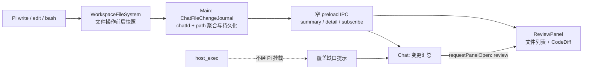

# 会话文件变更与只读审查技术方案

> 本文记录会话级文件变更日志、只读审查 IPC 和 ReviewPanel 的基础契约。产品展示已由 `docs/chat-file-diff-review-turn.md` 更新为按 assistant turn 展示独立产物卡片；本文中 composer 上方的会话累计入口属于历史实现，不再作为当前 UI 入口。

> **基础能力**：记录 Sailor 在当前会话中可确认的文件写入；产品入口按 assistant turn 展示在对应消息下方，点击产物卡片打开右侧「审查」面板，逐文件查看已写入工作区的只读 diff。不提供使用、取消或撤销。

## 1. 背景

### 现状与问题

| 环节       | 现状                                                                                            | 问题                                                                                     |
| ---------- | ----------------------------------------------------------------------------------------------- | ---------------------------------------------------------------------------------------- |
| agent 写入 | Pi 原生 `write`、`edit`、`bash` 通过 `createWorkspaceFileSystem` 的 `ReadWriteFs` 项目挂载写入  | 工具历史没有可聚合的文件前后快照；`fileChangeFeedback` 只兼容退役的 `apply_patch` 结果   |
| 宿主命令   | `host_exec` 在独立宿主进程中运行，以当前用户权限访问文件                                        | 它绕过 Pi 文件系统代理；同一目录还可能被用户终端或其他会话修改，不能仅凭目录差异可靠归因 |
| 会话与面板 | `WorkspaceChats` 按 chatId 保存消息；`review` 已是 chat scope 面板，`requestPanelOpen` 可激活它 | 实施前 `ReviewPanel` 是占位，会话里没有文件变更汇总入口                                  |
| 展示组件   | assistant-ui 提供独立的 `elements-code-diff`                                                    | 组件只接受文件名、增删行数和 diff 行，不采集文件变化                                     |

### 目标与验收

- 当前会话的 Pi 原生文件写入成功后，记录基于真实数据的文件数和净增删行数；没有记录时不显示假计数。当前 UI 由对应 assistant turn 下方的产物卡片承载入口。
- 点击产物卡片打开带 `turnId` 过滤的 `review` tab；面板按文件列出该轮变更，选中后显示只读 diff。切换会话后只看到所选 chatId 的记录，重启后可恢复。
- 新建、修改、删除及同一文件多次写入能够正确聚合；文件后来又被外部修改时，历史 diff 标为过期，不冒充当前工作区状态。
- 未捕获的来源、超出快照上限的文件、二进制内容和读取失败都显示明确状态，不编造增删行数。

### Non-Goals

- 不提供保留、取消、逐块选择、反向补丁或任何写入型审查操作；现有工具审批照常发生在写入前。
- 不实现 Git 工作区总览、`git status` 集成或用户手动终端的变更归因。
- `host_exec` 写入首版不计入「已记录」数量；会话执行过它时，界面明确提示宿主命令可能产生未记录改动。完整覆盖须单独设计可归因的宿主执行边界。
- 不把文件全文或整份 diff 塞进 `UIMessage` / `workspaces.json`，不把审查快照加入模型上下文。

## 2. 方案设计

### 结论与方案比较

采用主进程中按 chatId 隔离的**变更日志**。Pi 项目挂载在实际文件系统操作前后读取受限快照；主进程计算净 diff 并通过窄 IPC 提供给 renderer。面板使用官方 `CodeDiff` 的 standalone 形态，业务状态仍由 `components/chat/` 和 `ReviewPanel` 管理。

| 方案                           | 优点                                                    | 关键问题                                          | 结论                 |
| ------------------------------ | ------------------------------------------------------- | ------------------------------------------------- | -------------------- |
| 从工具消息解析路径和结果       | 接线少                                                  | 成功输出不保证含完整前后内容；`bash` 可改多个文件 | 不作为事实源         |
| 从 Git diff 推导本会话修改     | 能处理部分宿主命令                                      | 非 Git 目录、既有未提交改动和并发写入无法可靠归因 | 留给独立的工作区总览 |
| 在 Pi 文件系统边界记录前后快照 | 覆盖原生 `write/edit/bash`，可绑定 chat/run，独立于 Git | 不覆盖 `host_exec`；需要有界持久化                | 首版采用             |

### 分层与数据流



1. `PiRunner` 在主进程为项目挂载传入可信的 chatId/runId 记录上下文；renderer 不提供记录路径或文件内容。
2. 文件系统代理保留现有路径、敏感文件、符号链接和目录批量操作策略。对成功的 `writeFile`、`appendFile`、`rm`、`cp`、`mv` 在调用前后采集涉及的源/目标文件；失败调用不产生成功记录。Pi 的 `edit` 和虚拟 `bash` 均经过这一边界。
3. 日志以同一 chatId/path 的首次 `before` 与最新 `after` 计算**净变化**，内容回到原样时不列为当前变更。每次续写前比对上一版 `afterHash` 与存在性；不一致时开启新的连续段，仅展示最近段，并把总行数标为未知，避免把外部修改算进该会话。
4. 日志保存于 Electron `userData` 下的独立、版本化 sidecar，按 chatId 隔离，采用 0600 原子写入和串行更新；删除会话时清理相应记录。工作区原文件从不由审查操作写回。
5. main 在读取审查数据时再校验当前文件哈希与存在性。吻合时标为 `current`；不吻合时标为 `stale`，不可核验时标为 `unavailable`。界面明确区分「当时的改动」与「当前文件」。
6. composer 汇总和右侧面板通过只读 IPC 订阅失效通知后重新获取数据；摘要只返回文件元数据，选中后用 chatId/changeId 请求详情。主进程从工作区存储解析所属项目。

### 数据契约草案

```ts
type ChatFileChangeSummary = {
  chatId: string
  fileCount: number
  addedLines: number | null
  removedLines: number | null
  hasUntrackedHostExec: boolean
  hasTrackingError: boolean
  hasIncompleteDiff: boolean
  changes: readonly ChatFileChange[] // 摘要中 lines 为空
}

type ChatFileChange = {
  id: string
  chatId: string
  runId: string
  path: string // 相对项目根路径
  kind: 'added' | 'modified' | 'deleted'
  beforeHash: string | null
  afterHash: string | null
  state: 'current' | 'stale' | 'unavailable'
  addedLines: number | null
  removedLines: number | null
}

type ChatFileChangeDetail = ChatFileChange & {
  lines: readonly { kind: 'context' | 'added' | 'removed'; text: string }[]
  truncated: boolean
}
```

`null` 表示不能可靠计算，不等于零。`hasUntrackedHostExec` 来自本会话实际执行过的 `host_exec` 记录。`diff@9` 负责文本差异；官方 `CodeDiff` copied source 只负责呈现。侧栏覆盖其默认宽度和圆角，以匹配现有面板布局。

### 持久化与失败语义

- 快照保存完整 UTF-8 文本，变更日志和 diff 不设文件大小、记录数、计算时长、编辑距离或返回行数上限。二进制及非法 UTF-8 内容只保存哈希，不生成逐行文本差异或行数。
- 敏感路径和符号链接继续由工作区边界拒绝；sidecar 不保存工作区外路径，不向模型注入快照，不为 renderer 开放通用 fs。
- 日志持久化失败不把已成功的文件操作说成失败或回滚；当前进程的面板显示「记录未保存」。若 sidecar 本身不可读，重启后只能报告读取失败，无法恢复未落盘的记录。
- 记录与 IPC 必须防跨项目/跨会话读取；并发会话在同一文件上的交错修改应分段或标为过期，绝不把两边合并成一个确定 diff。
- `host_exec`、用户终端和外部编辑器不走该日志。执行过 `host_exec` 的会话显示「已记录的文件改动，宿主命令可能另有变更」，汇总数字只指已记录的 Pi 写入。

### UI 行为

- 变更摘要在有记录的 assistant turn 下方显示为独立产物卡片；卡片只携带该 `turnId` 的文件数、行数和路径，不把历史 turn 堆到 composer 下方。删除会话时随 sidecar 一起清理。
- 点击产物卡片激活带 `turnId` 过滤的 `review` tab；文件行可选中，面板空态、加载、过期、不可预览和读取失败均有独立反馈。
- 详情用官方 standalone `CodeDiff` 展示已写入的历史 diff。没有「应用」「取消」按钮，且不注册新的 human tool；保留现有工具调用与审批 UI。
- 亮/暗主题、窄窗口、长路径、长代码行和键盘焦点沿用 assistant-ui 设计及现有面板约束。

## 3. 实施与验证

| 阶段    | 产出                                              | 验证重点                                             |
| ------- | ------------------------------------------------- | ---------------------------------------------------- |
| 1. 记录 | Pi 文件变更采集、聚合、sidecar                    | 新建/编辑/删除/多次写入、失败、上限、并发、重启      |
| 2. 读取 | 只读 IPC、归属校验、失效通知                      | 跨会话拒绝、路径安全、过期检测、删除清理             |
| 3. 展示 | 汇总入口、ReviewPanel、官方 CodeDiff              | 点击定位、空态/缺口态、主题和窄窗口                  |
| 4. 验收 | 专用真实 Electron smoke + 类型检查/构建/范围 lint | 使用生产组件和 preload，验证真实写入到审查的完整路径 |

本方案由 `feat-chat-file-diff-review` 实施；Electron 冒烟入口为 `node tests/chat-file-diff-review-electron.test.mjs`。

## 4. 后续决策

- 若需要把 `host_exec`、用户终端和外部编辑器的变化也归因到会话，需要另评估宿主文件事件或隔离执行方案；简单比较命令前后的目录不能排除并发来源。
- 若未来加入撤销，必须另设计可验证的前后快照、当前哈希冲突检测、文件级/块级语义和失败恢复；本次日志不承诺可逆。

## 5. 参考

- [assistant-ui Code diff](https://www.assistant-ui.com/elements/code-diff)
- [`docs/panels.md`](panels.md) 的 chat scope、面板宿主和只读数据约束
- [`docs/architecture.md`](architecture.md) 的 Pi、`host_exec`、preload 与工作区边界
