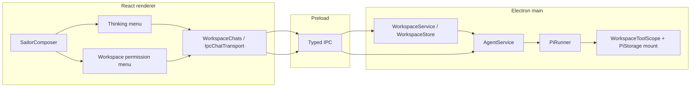
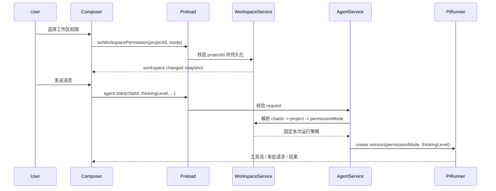

# Composer 思考等级与工作区权限技术方案

> **核心诉求**：把 Pi 的 thinking level 和工具权限变成 composer 中可见、可切换、可记住的运行选项，减少重复审批，同时保持执行策略、工作区边界和审批续跑仍由 Electron main 进程统一控制。

- 日期：2026-09-26。
- 状态：已实施并通过 checklist verifier；Electron smoke 证据见 `.agent-harness/evidence/composer-thinking-permissions-electron.md`。
- 适用版本：当前 Sailor 架构、`@ai-sdk/harness-pi@1.0.119`、`@assistant-ui/react@0.15.21`。
- 关联架构：[docs/architecture.md](architecture.md)。

## 1. 背景

### 1.1 现状与问题

| 环节           | 当前实现                                                                         | 问题                                                                                            |
| -------------- | -------------------------------------------------------------------------------- | ----------------------------------------------------------------------------------------------- |
| thinking level | `SailorComposer` 使用原生 `<select>`，选项来自设置页手工维护的 `reasoningLevels` | 能力配置和运行时能力重复；入口与模型菜单视觉不一致；选择只在 renderer 内存中存在                |
| Pi thinking    | `createPiConfiguration` 已把 `ReasoningEffort` 转成 Pi 的 `thinkingLevel`        | 共享类型缺少 Pi 的 `max`；`provider-default` 与 Pi `undefined` 的映射没有在 composer 中明确表达 |
| 工具权限       | `PiRunner` 按工作区策略运行，默认使用 `permissionMode: 'allow-all'`              | 每次 write/edit/bash 都可能产生审批，用户无法在工作区范围内选择信任等级                         |
| 权限持久化     | 工作区只持久化目录和会话，没有权限策略                                           | 重新打开同一工作区后仍需重复设置，且 renderer 无法直接决定执行权限                              |
| 审批续跑       | main 按 approval ID、chatId、runId 校验一次性审批                                | 权限切换不能影响已暂停的审批，否则会产生“等待中的请求突然自动执行”的风险                        |

### 1.2 目标

| 目标              | 验收标准                                                                                                       |
| ----------------- | -------------------------------------------------------------------------------------------------------------- |
| composer 统一入口 | 模型菜单同时承载模型列表与 thinking slider，权限保留独立的 `ComposerModelTrigger` / `ComposerMenu` 入口        |
| 使用 Pi 统一等级  | UI 使用 `off / minimal / low / medium / high / xhigh / max`，默认项映射为不传 `thinkingLevel`                  |
| 移除重复配置      | 设置弹窗不再显示或编辑 `reasoningLevels`；旧设置文件仍能读取并保存，不因字段缺失失败                           |
| 减少审批          | 工作区可选择 `allow-reads`、`allow-edits`、`allow-all`，策略在 main 固定到一次运行                             |
| 保持安全边界      | `allow-all` 只表示当前挂载工作区内的 Pi 原生工具自动执行，不扩大到主机任意文件、任意程序或 renderer filesystem |
| 可恢复且可审计    | 权限选择、运行快照、审批续跑、工作区切换和应用重启都有确定行为与测试证据                                       |

### 1.3 Non-goals

- 不把权限扩展成整台电脑访问；不开放 renderer 通用 `fs`、主机 shell 或任意 cwd。
- 不实现按路径、按命令字符串或按单个工具调用的复杂规则系统。
- 不把网页搜索、MCP 工具和用户驱动的真实终端强行纳入 Pi 原生 `permissionMode`；这些能力需要独立策略时另立 feature。
- 不在设置弹窗新增第二套 thinking level 配置页面。
- 不通过切换权限策略绕过已有 approval ID、过期时间、chatId/runId 绑定或敏感路径校验。
- 不删除历史设置文件中的 `reasoningLevels` 字段；本 feature 只停止暴露和依赖该字段，迁移清理另行处理。

## 2. 方案设计

### 2.1 方案对比

| 决策点              | 方案 A                             | 方案 B                                                  | 选择                                             |
| ------------------- | ---------------------------------- | ------------------------------------------------------- | ------------------------------------------------ |
| thinking level 来源 | 继续在设置页维护每个模型的等级数组 | 采用 Pi 的固定 `PiThinkingLevel`，由 Pi 负责会话级处理  | **B**：消除重复配置，composer 直接操作运行时选项 |
| thinking UI         | 原生 `<select>`                    | 复用模型选择的 trigger/menu/item                        | **B**：保持 composer 视觉和键盘行为一致          |
| 权限粒度            | 每次审批后记住某个工具调用         | 工作区保存三档基线策略，单次运行启动时冻结              | **B**：减少重复询问且不会把临时审批变成永久授权  |
| 权限存储            | renderer localStorage              | main-owned workspace project record                     | **B**：权限属于工作区且不能被 renderer 伪造      |
| 权限策略            | 自定义规则解释器                   | 直接使用 Pi `allow-reads` / `allow-edits` / `allow-all` | **B**：复用当前依赖的原生语义，减少策略分叉      |

### 2.2 整体架构



所有权保持不变：renderer 只选择和展示状态；WorkspaceService 解析 chatId 到 project；AgentService 在启动时读取项目权限；PiRunner 将策略和 thinking level 传给 Pi；文件系统、敏感路径和审批校验仍在 main。

### 2.3 Thinking level 契约

共享类型应从当前 `ReasoningEffort` 扩展为 Pi 对齐的联合类型：

```ts
type ThinkingLevel =
  'provider-default' | 'off' | 'minimal' | 'low' | 'medium' | 'high' | 'xhigh' | 'max'
```

`provider-default` 是 Sailor UI 的显示值，不传给 Pi；其余值映射如下：

| composer 值        | Pi 配置                         |
| ------------------ | ------------------------------- |
| `provider-default` | 不设置 `settings.thinkingLevel` |
| `off`              | `thinkingLevel: 'off'`          |
| 其他等级           | 同名 `thinkingLevel`            |

composer 显示固定的 Pi 标准等级，不再从 `ModelConfig.reasoningLevels` 生成菜单。Pi 的模型注册仍需提供 `reasoning` 能力标记；实施时应明确新配置模型的默认标记和旧模型的兼容行为。若底层模型能力不足，Pi 的会话能力解析负责降级或返回结构化错误，UI 不自行猜测 provider 能力。

运行请求继续携带 thinking level，但在一次 `agent.start` 后冻结：

```ts
interface AgentRunRequest {
  runId: string
  chatId: string
  messages: UIMessage[]
  thinkingLevel: ThinkingLevel
}
```

为避免不必要的公共字段双轨，实施时应同步替换 renderer、preload、IPC schema、WorkspaceService 和 PiRunner 的旧 `reasoning` 命名；如果迁移成本过高，也可以保留线上字段名，但文档和 UI 必须统一称为 thinking level，并在边界处完成一次转换。

### 2.4 Composer 交互

thinking level 与模型列表放在同一个模型选择菜单中，使用紧凑 slider；工作区权限保留独立入口：

```tsx
<ComposerModelTrigger
  model={`${selectedModelName} · ${thinkingLabel}`}
  open={modelOpen}
  onClick={() => setModelOpen(value => !value)}
/>
<ComposerMenu open={modelOpen} aria-label="模型与思考等级">
  <div data-model-list className="max-h-64 overflow-y-auto">
    {modelOptions.map(model => <ComposerModelItem key={model.id} ... />)}
  </div>
  <div data-thinking-control className="field shrink-0 rounded-xl">
    <input type="range" data-thinking-slider aria-label="思考等级" />
  </div>
</ComposerMenu>
```

实现要求：

1. 不使用原生 `<select>`；沿用模型菜单的 `aria-expanded`、Esc 返回 trigger、失焦关闭、`inert` 和窄窗口宽度限制。模型列表使用独立 `max-h-64 overflow-y-auto` 容器，thinking footer 位于滚动容器之外并始终可见；footer 只保留分隔线、文本和 slider，不使用嵌套卡片或额外底色。
2. 默认显示“模型默认”，而不是把 `off` 当作默认；用户明确选择“关闭”后才传 `off`。
3. 切换模型时不悄悄重置 thinking level；如果 Pi 在运行时将请求等级降级，应通过运行结果或错误状态明确反馈。
4. 每个 chatId 保留独立选择，切换会话不串值；审批续跑使用启动时的原等级，不读取中途新选择。
5. Slider 复用项目的 shadcn `Slider`（基于现有 `radix-ui` 依赖）：控件高 20px、轨道高 6px、无边框滑块直径 16px。八个 Pi thinking level 各对应一个等距刻度；刻度区域左右缩进 8px，与滑块中心的有效移动端点对齐。填充、轨道、刻度和焦点环使用现有外观主题变量，键盘每次移动一个等级，`:focus-visible` 时保留焦点环。

### 2.5 设置页兼容与模型配置

设置弹窗的模型详情移除“推理等级”输入框和说明，`providerForm` 不再因用户编辑该字段产生新值。为了兼容现有 `model-providers.json`：

- `ModelConfig.reasoningLevels` 在读取 schema 中暂时保持可选/可读。
- `normalizeModel` 不因旧字段缺失失败；保存时可以保留旧字段，或在明确迁移阶段统一省略，但不能把旧文件写成不可解析状态。
- 新模型不再要求用户填写等级数组。
- 运行时不得继续用 `reasoningLevels.length` 作为唯一的 Pi `reasoning` 能力判断；该判断必须迁移到 Pi 对齐的模型能力策略。

### 2.6 工作区权限模型

使用 Pi 已有权限模式：

| UI 选项          | 存储值        | 自动执行              | 仍需审批                              |
| ---------------- | ------------- | --------------------- | ------------------------------------- |
| 请求批准         | `allow-reads` | read、grep、glob、ls  | write、edit、bash                     |
| 自动编辑         | `allow-edits` | 只读工具、write、edit | bash                                  |
| 工作区域默认执行 | `allow-all`   | Pi 原生 builtin 工具  | Pi 原生 builtin 工具不再产生 approval |

“工作区域默认执行”只改变 Pi builtin 工具的审批基线。`read_document`、web search、ask_user、update_plan 等 host/MCP 工具继续按各自现有协议执行；真实终端仍是用户主动操作的独立面板。

权限属于项目工作区而不是单个 chat。推荐在持久化 project record 中增加可选字段：

```ts
type WorkspacePermissionMode = 'allow-reads' | 'allow-edits' | 'allow-all'

interface ProjectSummary {
  id: string
  name: string
  rootPath: string
  permissionMode?: WorkspacePermissionMode
}
```

新项目和旧项目缺失字段时默认 `allow-all`；side chat 仍强制只读。renderer 通过 workspace snapshot 获得当前项目策略，并通过窄 API 请求修改；主进程必须再次按 projectId/chatId 校验归属，不能接受 renderer 传入任意 rootPath。

### 2.7 权限选择与运行时序



关键约束：

- 运行开始后，后续修改工作区权限只影响下一次新运行。
- 待审批的运行沿用启动时的策略；切换菜单不能自动批准或撤销当前 approval。
- 新用户消息会撤销旧 approvals，和现有 `revokeApprovals` 行为一致。
- side chat 使用主会话所属工作区的权限，但其 `activeTools` 仍只允许只读集合；权限策略不能扩大侧聊能力。
- 项目删除、工作区路径失效、应用重启不应让 renderer 缓存的策略继续授权；main 读取持久化状态并按默认值或错误 fail closed。

### 2.8 IPC 与持久化变更

建议新增或扩展以下窄契约：

```ts
type WorkspacePermissionUpdate = {
  projectId: string
  mode: WorkspacePermissionMode
}

interface WorkspaceApi {
  setPermission(input: WorkspacePermissionUpdate): Promise<void>
}
```

IPC handler 使用 Zod 严格校验 `projectId`、`mode`，调用 `WorkspaceService.setPermission`。该方法应：

1. 校验项目存在并等待当前 store mutation 完成。
2. 将 mode 写入项目记录，使用现有原子临时文件 + rename 机制。
3. 发布 `workspace:changed`，让所有打开的 chat 重新投影当前策略。
4. 不修改聊天消息、Pi checkpoint 或历史 approval。

持久化 schema 使用 additive default，已有 `version: 1` 文件仍可读取。若未来需要版本迁移，应在 WorkspaceStore 内完成，而不是让 renderer 解释两种格式。

### 2.9 安全边界

- `allow-all` 不能跳过 `WorkspaceToolScope` 的绝对路径、`..`、越界符号链接和敏感凭据路径拒绝。
- Pi 的 bash 仍运行在 just-bash sandbox，不能借权限模式执行主机上的 pnpm、Node 或任意二进制。
- approval 响应仍绑定真实 approval ID、chatId、runId、toolCallId 和 toolName，并一次性消费。
- renderer 只提交 enum 和 projectId；main 不信任 renderer 传来的权限描述、rootPath 或工具参数。
- settings snapshot 不暴露 API key、Pi checkpoint 或宿主文件系统对象。
- 日志和 UI 不打印凭据、完整绝对路径中的敏感部分或原始 provider 响应。

## 3. 实施计划

| 阶段        | 内容                                                                             | 产出                                |
| ----------- | -------------------------------------------------------------------------------- | ----------------------------------- |
| P1 契约     | 扩展 thinking level、permission mode、project schema、IPC schema；保留旧设置读取 | 类型检查、契约单测                  |
| P2 运行时   | PiRunner 使用请求级 thinking level 和项目级 permission mode；冻结运行策略        | Pi/provider、权限和审批续跑测试     |
| P3 composer | 复用模型菜单实现 thinking 与权限菜单；移除设置页手工等级输入                     | renderer 测试、真实 Electron 冒烟   |
| P4 回归     | 更新 README/architecture、运行全量 typecheck/build/test、浅深色和窄窗口验收      | feature verifier evidence、视觉记录 |

实施过程中一次只推进一个 feature checklist；若发现需要联网权限或按路径规则，应另立 feature，不能扩大本方案。

## 4. 验证计划

### 自动化

- `tests/reasoning-selection.test.ts`：Pi 标准等级、`provider-default` 映射、`max`、切换模型/会话状态。
- `tests/workspace-permissions.test.ts`：旧 project 默认策略、三档持久化、项目归属校验、并发 mutation。
- `tests/tool-write-approval.test.ts` 与新增 Pi runner 测试：三档模式的 approval 行为、拒绝/续跑、过期和重启失效。
- `tests/composer-thinking-permissions-electron.test.mjs`：真实 Electron 中打开 composer 菜单、选择 thinking level、选择工作区权限、刷新 snapshot 后状态保留、运行时策略生效。
- `pnpm run typecheck`、`pnpm run build`、`pnpm run lint` 和现有全量测试。

### 视觉与交互

在 Electron 真实窗口中检查浅色/深色、1440×900 和窄窗口：

- 模型菜单使用 assistant-ui `floating` surface；模型列表单独滚动，thinking footer 使用 assistant-ui 的间距和文本语义，保持扁平、无嵌套卡片并始终可见。模型与权限 trigger 使用紧凑间距，窄窗口下菜单受视口宽度约束。
- 菜单打开后 Esc、点击外部、Tab/Enter 和失焦行为正确。
- 权限说明不会遮挡 composer 或发送按钮。
- 运行中切换选项不会改变当前任务；新消息使用新策略。

## 5. 风险与回滚

| 风险                        | 影响                  | 缓解                                                         |
| --------------------------- | --------------------- | ------------------------------------------------------------ |
| provider 不支持请求等级     | 生成失败或等级被降级  | Pi 负责能力解析；保留模型默认；错误通过已有 agent error 显示 |
| 旧设置文件缺字段/旧字段异常 | 设置加载失败          | schema additive default，保存前结构化 normalize              |
| 权限切换影响挂起审批        | 未预期执行或审批失效  | 运行启动时冻结 mode，审批记录继续按原 run 校验               |
| 项目策略与 side chat 不一致 | 侧聊越权              | side chat 的 activeTools 白名单优先于 permission mode        |
| renderer 缓存过期           | UI 显示与 main 不一致 | 每次 run 在 main 重新解析；变更广播后刷新快照                |

回滚只需移除 composer 入口和 permission IPC，并让 PiRunner 恢复 `allow-reads` 与旧 thinking 映射；新增 project 字段采用可选字段，不影响旧文件读取。

## 6. 待确认问题

| 问题                                | 当前建议                                                        | 影响                                     |
| ----------------------------------- | --------------------------------------------------------------- | ---------------------------------------- |
| Pi 对自定义 provider 的具体等级支持 | 先使用 Pi 标准等级和运行时 clamp；provider 报错沿用 agent error | 可能需要后续 provider capability feature |
| `reasoningLevels` 旧字段何时删除    | 本 feature 只停止编辑和依赖，保留兼容读取                       | 避免无必要的数据迁移风险                 |
| 权限是否需要单独的“本次运行”选项    | 第一版只做工作区持久化，运行中仍冻结                            | 可在后续增加临时 override                |
| MCP/联网权限是否共用菜单            | 不共用；另立策略 feature                                        | 避免误把 Pi builtin 权限当成全局能力     |

## 7. 评审清单

- [ ] thinking level 已完全从设置弹窗移除，composer 使用官方模型菜单视觉。
- [ ] `max`、`off`、`provider-default` 的类型、IPC、Pi 配置映射一致。
- [ ] 权限策略只在 main 解析和持久化，renderer 不可直接授予权限。
- [ ] 三档模式与审批续跑、重启失效、side chat 白名单都有测试。
- [ ] 专用 Electron 冒烟和视觉证据已记录。
- [ ] README、architecture 和 feature evidence 与最终实现一致。
