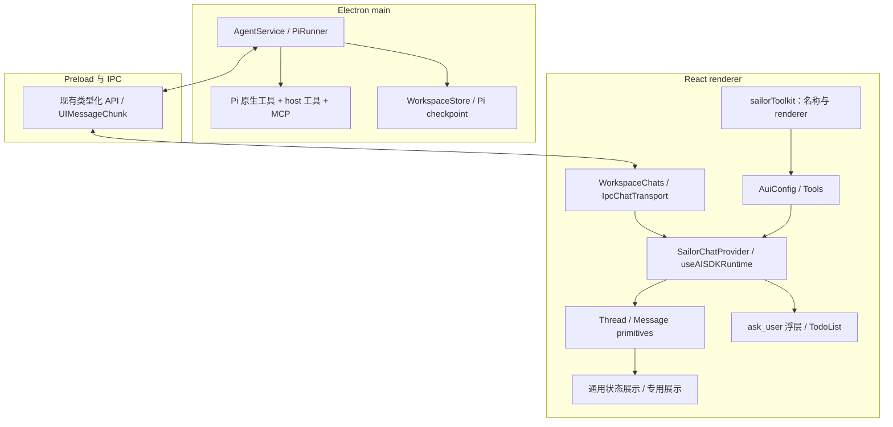
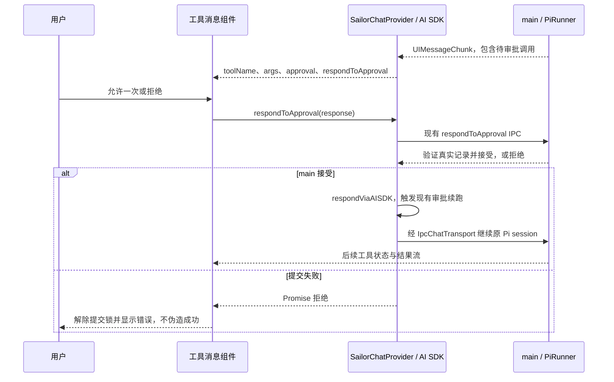

# Sailor 工具 UI 注册表重构方案

> **核心诉求**：通过 assistant-ui 的 `defineToolkit + Tools + AuiConfig` 统一工具消息的 renderer 注册，让新增工具展示有明确入口，同时保持现有工具执行、审批、输入区交互和会话生命周期。

- 日期：2026-09-25。
- 状态：技术方案已编写；重构代码尚未实施，实施验收尚未执行。
- 代码核查基线：`1cad4c0`（`fix: 修改todolist 闪烁问题`）。实施前应重新检查 HEAD、依赖版本和工作区状态。
- 本文是拟实施设计；[architecture.md](architecture.md) 描述现有架构。
- 已确认约束：暂不接入 Generative UI；不要求兼容旧版本消息格式；采用仅注册 UI 的 toolkit；继续使用 Electron 主进程中的 Pi 执行工具。

## 1. 背景

### 1.1 现状与问题

| 环节     | 当前实现                                                           | 重构要解决的问题                                               |
| -------- | ------------------------------------------------------------------ | -------------------------------------------------------------- |
| 会话实例 | `WorkspaceChats` 按 chatId 持有 AI SDK Chat                        | UI 注册应接到现有实例，不产生第二套会话所有权                  |
| runtime  | `SailorChatProvider` 使用 `useChat({ chat })` 和 `useAISDKRuntime` | Provider 尚未配置统一的 toolkit                                |
| 消息展示 | Thread 的 ToolFallback 指向 `SailorToolCall`                       | 按工具名分支分散在 fallback 内，工具增加后难以查找其展示入口   |
| 工具异常 | `StructuredToolFallback` 混合通用错误和搜索、网页、退役工具分支    | 专用结果和通用状态职责混杂；注册新 renderer 容易漏掉错误与审批 |
| 用户问题 | `ask_user` 在输入区浮层显示，消息区返回 null                       | 不能照搬官方消息内卡片示例，导致重复问题或错误的回答协议       |
| 计划     | workspace snapshot 驱动输入区 TodoList                             | `update_plan` 成功调用不显示消息行，失败仍需可见               |
| 执行     | main 中的 HarnessAgent + Pi，原生/host/MCP 工具                    | UI registry 不应成为另一份执行注册表                           |
| 测试     | 部分 UI 测试直接 SSR 渲染组件                                      | SSR 不运行 effect，无法证明 toolkit 的客户端注册和清理生效     |

注册表的收益是集中管理“工具名 → 消息 renderer”，复用官方匹配路径。它不会自动生成卡片、实现审批、推导所有后端类型或建立数据持久化。

### 1.2 目标与验收指标

| 目标           | 可检查的标准                                                                              | 验收时点   |
| -------------- | ----------------------------------------------------------------------------------------- | ---------- |
| 注册入口清楚   | 当前存在专用展示/隐藏策略的工具均有明确 registry 条目；新增一个展示无需扩展多个工具名分支 | 阶段 P2    |
| 执行行为一致   | 相同测试输入下，模型工具集合、IPC 请求、工具执行次数和结果相同                            | 阶段 P3    |
| 状态完整       | 运行、完成、失败、取消、待审批、拒绝和提交失败均有预期表现                                | 阶段 P2/P3 |
| 展示唯一       | 消息内工具最多一个视图；ask_user 仅在输入区；正常计划仅在 TodoList                        | 阶段 P2/P3 |
| 会话隔离       | 主侧聊同时挂载、A/B 切换和后台完成不串状态或响应对象                                      | 阶段 P3    |
| 当前版本可恢复 | 本次版本写出的消息能重新打开，读取历史不会执行工具                                        | 阶段 P3    |
| 可复现验证     | 全量自动化、Electron 场景及视觉证据都有命令、结果、环境和未覆盖项                         | 阶段 P4    |

### 1.3 范围与非目标

本次修改 renderer 的工具注册和分发，按需拆分现有展示组件，增加对应的挂载、交互与回归测试。

本次不包含：

- `@assistant-ui/react-generative-ui`、模型动态生成界面、`present`。
- `"use generative"` 编译插件、`AISDKToolkit`、新 HTTP 服务或监听端口。
- 替换 `useAISDKRuntime`、`IpcChatTransport`、`WorkspaceChats`、Pi 或 MCP 执行链。
- 改造 ask_user 暂停协议、合并问答与写入审批、开启前端工具执行。
- 修改工具名称、工具 schema、IPC 契约、模型提示词、持久化格式或安全权限。
- 专用卡片视觉改版、重新启用已退役工具、仓库范围的 legacy 清理。

用户已免除旧版本消息兼容要求：不新增旧格式迁移器或兼容测试。仍须验证当前版本的持久化、重启失效和不重放副作用；免除兼容不等于授权清空开发数据。被迁移文件内已确认仅服务退役工具的分支，可在引用审计后删除；跨模块兼容清理另列范围。

## 2. 方案设计

### 2.1 方案对比与决策

| 方案                                                   | 收益                                       | 成本/限制                                        | 决策           |
| ------------------------------------------------------ | ------------------------------------------ | ------------------------------------------------ | -------------- |
| 继续向 fallback 添加分支                               | 接入改动最少                               | 映射分散，难以确认状态处理完整性                 | 不作为目标结构 |
| `defineToolkit({ name: { type: 'backend', render } })` | 官方按名称匹配、集中注册、复用现有 runtime | 需处理注册时序与专用 renderer 的状态边界         | **采用**       |
| 为每个组件调用独立注册 hook                            | 可局部注册                                 | 注册数量和卸载关系更难管理，缺少统一入口         | 不采用         |
| `"use generative"` + 编译插件 + `AISDKToolkit`         | 可在一个文件声明 schema、执行器和 UI       | 涉及 Electron 双构建目标、执行模型和工具生命周期 | 超出本次范围   |

`type: 'backend'` 表示工具在 assistant-ui 的前端执行器之外执行。对 Sailor 而言，这个执行方是已有 Electron main/Pi；不要求独立后端服务。官方 “UI-Only for Existing Tools” 文档明确提供这一用法。

当前安装版本核查：`@assistant-ui/react@0.15.21`、`@assistant-ui/ai-sdk@0.0.7`、`ai@7.0.107`、`@ai-sdk/harness@1.0.117`、`@ai-sdk/harness-pi@1.0.119`。本次接入不需要新增运行时依赖。

### 2.2 整体架构



所有权约定：

| 数据/能力           | 权威来源                                         | toolkit 的职责                         |
| ------------------- | ------------------------------------------------ | -------------------------------------- |
| 模型能调用哪些工具  | main 的 `agent.tools` 及侧聊 `activeTools`       | 不授予能力                             |
| 输入/输出与校验     | Pi builtin、host tool schema、共享契约、MCP 数据 | renderer 读取并按需要收窄              |
| 消息 renderer       | `sailorToolkit` 与通用 fallback                  | 集中映射                               |
| 审批有效性          | main 的审批记录                                  | 展示并调用既有 runtime action          |
| ask_user 有效性     | `AskUserInteractionStore`                        | 保留输入区投影，不创建新 pending store |
| 计划内容            | 持久化 plan + `WorkspaceChats` 的有效快照        | 不从消息重新汇总计划                   |
| Chat 和运行生命周期 | `WorkspaceChats` / AgentService                  | 不持有执行状态                         |

### 2.3 文件组织与接入位置

下列“新增”路径是计划产物，尚未创建：

| 文件                                                                | 操作           | 职责                                                              |
| ------------------------------------------------------------------- | -------------- | ----------------------------------------------------------------- |
| `src/renderer/src/components/chat/tools/sailorToolkit.tsx`          | 新增           | 模块级 toolkit、明确的工具名映射及首次注册前的 fallback 桥接      |
| `src/renderer/src/components/chat/runtime/SailorChatProvider.tsx`   | 修改           | 给现有 AssistantRuntimeProvider 传 `config`                       |
| `src/renderer/src/components/chat/tools/SailorToolCall.tsx`         | 重构           | 通用运行/完成展示、审批和异常处理；专用名称策略迁入 registry      |
| `src/renderer/src/components/chat/tools/StructuredToolFallback.tsx` | 按需拆分       | 保留通用失败反馈，提取当前工具的专用展示；清理本次触及的退役分支  |
| `src/renderer/src/components/chat/tools/toolMessageRenderers.tsx`   | 按需新增       | ask_user 消息隐藏、update_plan 消息策略；避免每个微小策略单建文件 |
| `src/renderer/src/components/chat/thread/SailorThread.tsx`          | 修改           | ToolFallback 使用与 toolkit 同源的桥接组件                        |
| `tests/fixtures/ToolCallPreview.tsx`                                | 修改           | 与生产接线一致，避免测试仍停留在旧 fallback 路径                  |
| `tests/toolkit-registration.test.ts`                                | 新增           | 定义边界、backend 序列化、名字冲突和参数处理测试                  |
| `tests/toolkit-electron.test.mjs` 及对应 fixtures                   | 新增           | 真实 Provider/Thread 挂载、StrictMode、注册清理和交互测试         |
| `README.md`、`docs/architecture.md`                                 | 实施完成时更新 | 描述最终已实现结构及验收入口                                      |

通用 renderer 可以供多个条目复用。只有实际 UI 行为不同才拆组件；不为未来扩展增加通用适配器框架。

Provider 与 toolkit 的导入关系保持单向。叶子 renderer 不导入 toolkit；消息隐藏 renderer 不导入输入区 `SailorAskUserCard`，避免 `Provider → toolkit → Card → Provider` 的循环依赖。现有问答 Context 继续由输入区卡片消费。

### 2.4 接线示意

以下代码表达目标接口，示例中的提取组件需要在实施时创建并通过类型检查：

```tsx
// tools/sailorToolkit.tsx
import { defineToolkit, type ToolCallMessagePartComponent } from '@assistant-ui/react'
import { SailorToolCall } from './SailorToolCall'
import { AskUserMessage, UpdatePlanMessage } from './toolMessageRenderers'

export const sailorToolkit = defineToolkit({
  read_document: { type: 'backend', render: SailorToolCall },
  write: { type: 'backend', render: SailorToolCall },
  edit: { type: 'backend', render: SailorToolCall },
  bash: { type: 'backend', render: SailorToolCall },
  ask_user: { type: 'backend', render: AskUserMessage },
  update_plan: { type: 'backend', render: UpdatePlanMessage },
  // web_search / fetch_page 在提取既有状态分支后注册，见工具清单。
})

// 官方 effect 完成注册前也遵守同一份消息展示策略。
export const SailorToolFallback: ToolCallMessagePartComponent = (props) => {
  const entry = Object.hasOwn(sailorToolkit, props.toolName)
    ? sailorToolkit[props.toolName as keyof typeof sailorToolkit]
    : undefined
  const Render = entry?.render ?? SailorToolCall
  return <Render {...props} />
}
```

```tsx
// SailorChatProvider.tsx：增加 import 与 config，保留已有 hooks/Context/action。
import { AuiConfig, Tools } from '@assistant-ui/react'
import { sailorToolkit } from '../tools/sailorToolkit'

// 在现有组件中，runtime 仍来自 useAISDKRuntime(adapted, existingOptions)。
const config = AuiConfig({ tools: Tools({ toolkit: sailorToolkit }) })

// 在现有 Provider 嵌套位置添加 config。
<AssistantRuntimeProvider runtime={runtime} config={config}>
  <WorkspaceContextRenderer />
  {children}
</AssistantRuntimeProvider>
```

实施要求：

1. `sailorToolkit` 和 renderer 引用保持模块级稳定；不捕获 chatId、runId、用户答案或可变状态。
2. 每个 `SailorChatProvider` 有各自的运行时 scope；可以共享静态定义，不能共享 pending/审批状态。
3. backend 条目只包含类型、展示组件和必要的 display 配置；不附加 `execute`、模型参数或上传 schema。
4. 不使用 `humanTool()`、`externalTool()`、`stubTool()` 等构建期 marker；无对应编译插件时它们会抛错。
5. 不新增 `useChatRuntime()` 或 `Chat` 实例；继续保留附件 adapter、WorkspaceContextRenderer 和两类回答入口。
6. 不改 `sendAutomaticallyWhen`。当前写入审批使用 `lastAssistantMessageIsCompleteWithApprovalResponses`；本次没有引入前端执行结果续跑。

### 2.5 当前工具清单与显示策略

“不注册”表示复用通用 fallback，不能据此将该工具从 main 删除。toolkit 可以是执行工具集合的子集，不要求逐个复制 Pi 的所有 schema。

| 名称                         | 执行来源                  | 消息 renderer 策略                               | 其他展示/限制                                                   |
| ---------------------------- | ------------------------- | ------------------------------------------------ | --------------------------------------------------------------- |
| `read`、`grep`、`glob`、`ls` | Pi builtin                | 通用 ToolCall + 通用失败/取消处理，可不显式注册  | 文件参数以实际 builtin 字段为准                                 |
| `write`、`edit`、`bash`      | Pi builtin                | 注册复用完整状态 renderer，保留 ApprovalCard     | 主进程一次性授权；侧聊没有执行权限                              |
| `read_document`              | main host tool            | 首个接入试点，复用现有状态与结果展示             | 保留失败 envelope 和截断提示，不新设计文档卡片                  |
| `web_search`                 | main MCP，源工具名 search | 提取当前有效的搜索展示策略到注册条目             | 正常状态先保持现有 ToolCall；错误分支的结果解析与链接校验需保留 |
| `fetch_page`                 | main MCP                  | 提取当前有效的网页展示策略到注册条目             | 未知数据回退；打开预览继续走现有面板 action                     |
| `research`                   | main MCP                  | 通用 fallback                                    | 不假设它与 web_search 使用相同结果 schema                       |
| `ask_user`                   | main host tool            | `AskUserMessage` 返回 null                       | 输入区浮层是唯一问题展示入口，回答走原 responder                |
| `update_plan`                | main host tool            | 正常运行/完成返回 null；异常调用复用通用状态处理 | 输入区 TodoList 从 workspace plan 投影                          |
| `compaction`                 | Pi 流事件投影             | 通用 fallback                                    | 不是要新注册给模型的执行器                                      |
| 未知名称                     | 未来工具或外部数据        | 通用 fallback，安全展示名称/状态/结果            | 不因工具未注册而丢失消息                                        |
| 退役名称                     | 旧开发数据                | 不新增专用注册，不承诺旧格式兼容                 | 不再恢复旧执行能力                                              |

搜索卡片的旧 renderer 不等于当前 MCP 成功结果的完整适配。不能仅因注册了 `WebSearchToolFallback`，就把它直接应用于所有状态并顺手改变成功态外观。先锁定当前行为，再提取代码；新的富结果展示单独设计。

### 2.6 注册生效时序与 fallback

本地 `Tools` 在 `useEffect` 中注册 renderer，Thread 按名称优先选中注册的 renderer，否则使用 ToolFallback。第一帧或 scope 重建时可能暂时走 fallback。

为防止 ask_user、update_plan 在注册前闪出普通工具行，`SailorToolFallback` 读取**同一个** `sailorToolkit` 条目；它只返回一个 React 组件，不再次向官方 registry 注册，不执行工具，也不维护第二张配置表。未知名称使用通用 renderer。

专用 renderer 在异常时应调用通用叶子组件，而不是再次调用 `SailorToolFallback`，避免同名递归。使用 own-property 查询，避免 `constructor` 等外部名称命中对象原型。

`Tools` 的动态注册完成后，正常分发继续由官方 primitive 处理。测试必须同时断言 `aui.tools` 中的注册已经生效以及实际输出正确；只看 HTML 正确可能掩盖“始终由桥接 fallback 渲染”的接线错误。

尽量保持注册前后同名工具使用同一个组件引用，以免 effect 生效时重置展开状态或审批中的控件。布局分组仍沿用当前 Thread + `SailorToolCalls`；不将 `display: 'standalone'` 误解为“显示在输入区”，该字段只控制消息内分组。

### 2.7 通用状态与输入校验

普通工具的状态处理顺序：

| 条件                                                     | 处理                                                 |
| -------------------------------------------------------- | ---------------------------------------------------- |
| 真实待处理审批                                           | SailorApprovalCard，保留参数预览和允许一次/拒绝      |
| incomplete、isError、业务结果 `ok: false`、拒绝/失效审批 | 保留失败/取消原因与既有恢复建议，不显示成功勾选      |
| requires-action 但没有可识别的 action                    | 显示需要处理/无法完成的说明，不伪造可提交按钮        |
| running                                                  | 展示运行状态，允许 args 为部分对象                   |
| complete                                                 | 展示结果；以 `result !== undefined` 判断结果是否存在 |
| 参数或结果无法按专用格式解析                             | 安全回退到通用展示，不推断执行成功                   |

`ask_user` 和 `update_plan` 按前表的消息可见性策略先处理。隐藏消息不应停止 main 的执行或 composer 的数据订阅。

- `0`、`false`、空字符串可能是有效结果，不使用 `if (result)` 判断完成。
- `ToolCallMessagePartProps` 的静态类型不保证流式参数完整；缺字段时等待/降级展示。
- schema 类型按需复用现有 shared 模块；renderer 不为类型提示导入 main、Pi Node 实现或凭据依赖。
- backend UI-only 条目不自动推导 main 的参数类型，也不提供运行时校验；对真实边界使用现有 Zod schema 或显式类型收窄。
- MCP 结果可能是内容块或非预期对象；按当前真实样例验证，不能拿旧 fixture 假设所有响应形状相同。
- 网址先通过 URL 解析及 HTTP(S) 协议校验，解析失败回退；外部文本作为文本/既有 Markdown 渲染，不注入任意 HTML。

### 2.8 两类交互的核心流程



审批需要同时覆盖：main 接受前失败、main 接受后后续传输失败。后一种不能声称“再点一次就一定成功”，主进程的一次性消费仍是权威；记录实际可恢复行为并提供现有错误反馈。

ask_user 的流程独立：main 的 `createAskUserTool` 创建 pending Promise；renderer 从运行中的消息投影问题到 composer；卡片调用 `useSailorAskUserResponder()`；Provider 取得当前 runId 并发出 `respondToAskUser` IPC；main 校验 chatId/runId/toolCallId/interactionId 并 resolve 原 Promise，原 turn 继续。

它不是 assistant-ui frontend/human executor，也不通过新增 `addResult` 或另发 user 消息继续。错误、过期、重复响应和取消仍由既有主进程记录决定，UI 注册不新增超时实现。

### 2.9 model context、权限与持久化

`Tools` 会同时注册 UI 和 model context，但当前 `toToolsJSONSchema` 默认过滤 backend 条目；现有 IPC transport 也只提交既定的 AgentRunRequest。不能把“进入 model context”误写成“向模型新增可调用工具”。

边界测试应证明：纯 backend toolkit 的默认可上传 schema 集合为空；传输请求仍符合当前契约；main 工具清单及侧聊 activeTools 不变。不能仅测试 toolkit 有多少个 key。

本次不修改数据模型：继续保存 UIMessage 原生 parts、workspace plan 和 Pi checkpoint。React renderer、函数和 toolkit 对象均不序列化。相同版本重启后重新注册 UI，再从已保存的消息渲染；不触发执行器或恢复失效的交互。

## 3. 风险、实施任务与回归

### 3.1 风险清单

| 风险                              | 后果                                  | 控制与验收                                           |
| --------------------------------- | ------------------------------------- | ---------------------------------------------------- |
| 专用 renderer 绕过公共状态判断    | 审批按钮丢失、错误显示成功            | 完整状态表测试；实际点击 write/edit/bash             |
| 注册前 fallback 与注册后行为不同  | 隐藏工具闪现、展开状态重置            | 同源映射桥接，逐帧观察首次挂载和切换                 |
| toolkit/renderer 引用不断重建     | effect 重复注册、状态重置甚至更新循环 | 模块级定义；StrictMode + 连续流式更新测试            |
| Provider 或 Chat 被重新创建       | 后台流中断、会话内容丢失              | 保留现有所有权；A/B 切换与侧聊并发测试               |
| renderer 闭包捕获旧 chatId/runId  | 答案或审批发给错误会话                | 使用既有 scope/responder；断言响应对象和执行计数     |
| 计划/问答重新注册到消息区         | 重复 UI、计划提前退场                 | composer 唯一展示；复用计划 Electron 生命周期用例    |
| 误将 ask_user 设为 human/frontend | 新旧暂停协议冲突、重复续跑            | 限定 backend UI 注册，验证原 Promise 只 resolve 一次 |
| 类型断言替代数据校验              | 部分参数或 MCP 响应造成白屏           | 缺字段/非法对象/非法 URL/多种结果形状测试            |
| renderer 与 Provider 循环依赖     | 初始化异常或 HMR 不稳定               | 导入链检查，真实生产构建启动                         |
| 专用组件新增第二条工具 UI         | 卡片重复                              | 同一 toolCallId 的实际 DOM 展示计数                  |
| 旧 fixture 与真实格式不一致       | 单测通过但实际运行失败                | 使用实际 AI SDK 转换和当前主进程流样例               |
| 以部分测试声称全量通过            | 漏掉 Electron 和并发问题              | 测试清单 + 明确执行/跳过/失败记录                    |

### 3.2 实施阶段

阶段按依赖顺序推进；工作量为规划估算，不构成完成时间承诺。

| 阶段        | 工作                                                             | 产出与退出标准                              | 粗估       |
| ----------- | ---------------------------------------------------------------- | ------------------------------------------- | ---------- |
| P0 基线     | 注册实施 feature，读取最新代码；记录现有状态、全量测试清单和截图 | 可复现基线；既有失败有明确归属              | 半天       |
| P1 最小接线 | 注册 read_document 复用组件，挂载 config，建立实际客户端测试     | 官方 registry 真实生效；原 IPC/执行次数不变 | 半天       |
| P2 展示迁移 | 抽取通用状态；迁移当前专用分支及隐藏规则；接入首次注册 fallback  | 各工具状态一致、无重复卡片、无循环依赖      | 半天至一天 |
| P3 全量回归 | 自动化、审批与问答完整链路、会话隔离、生产 Electron 视觉验收     | 回归矩阵通过；失败已修复或明确阻塞交付      | 一天左右   |
| P4 收尾     | 同步实际架构，verifier 记录证据，clean-state                     | 文档对应最终实现，证据可重跑                | 半天       |

实现代码量预计小到中等；主要时间用于真实挂载和交互验证。如果 P1 暴露运行时版本问题，先记录复现，不默认升级依赖或重写 transport。

### 3.3 建议的实施 checklist

以下供未来实现 feature 使用，本次文档交付不会把这些项标记 done：

| 项目                             | 覆盖方式                       | 验证要求                                    |
| -------------------------------- | ------------------------------ | ------------------------------------------- |
| 明确基线、工具展示清单与权限边界 | static / integration           | 当前 schema 与实际工具流对齐；记录 baseline |
| toolkit + Provider 接线生效      | integration / e2e              | 新 registry 测试 + 真实客户端挂载           |
| 工具状态与输入区策略迁移         | integration                    | 工具消息、审批、问答、计划测试              |
| 多会话与交互链路验证             | integration / e2e              | 主侧聊、后台、切换、取消、重启              |
| 全量测试、生产构建与视觉验收     | integration / manual-exception | 下方完整回归矩阵及 evidence                 |
| 文档同步和收尾                   | static                         | verifier、文档核对、clean-state             |

行为测试应先锁定预期；已有行为保护测试在重构前可以通过，无须为了 TDD 人为制造失败。新增 registry 接线和故障复现用例可先失败后修复。

### 3.4 新增客户端测试要求

复用 `tests/fixtures/plan-todo-electron.cjs` 的 Electron + Vite + React 实际挂载方式，创建 toolkit 专用 fixture。现有依赖已经满足该路径，不因测试引入第二套 UI runner。

测试分两层：

1. 组件挂载层：受控消息流 + 真正的 `AssistantRuntimeProvider`、`Tools`、Thread；通过 aui scope 和 DOM 同时断言，覆盖 effect 注册/清理与分组。
2. 业务链路层：使用实际 `SailorChatProvider + Chat + IpcChatTransport`，配合隔离 preload/主进程 fixture 和本地确定性模型响应，断言真实调用对象与执行次数。纯 UI fixture 不能声称验证了 Pi。

必须覆盖：

- 注册成功后每个名称只有一个预期 renderer；StrictMode 重挂载、Provider 卸载后注册正确清理。
- 注册前后 ask_user 不出现消息行，正常 update_plan 不出现消息行，失败计划仍可见。
- 未知工具名称、包括对象原型名称，正确走通用 fallback。
- args 从部分内容到完整对象，result 从 undefined 到有效结果、失败或取消；无 React 无限更新、未捕获错误。
- 两个同名工具不同 toolCallId 的展开/提交状态独立；同一工具从 waiting 到 complete 不遗留按钮。
- 主/侧聊同时挂载，多个会话来回切换，背景流继续；控件响应绑定原会话而非当前全局选中项。
- 不只渲染静态 HTML；实际点击允许、拒绝、回答、跳过、停止和切换，并检查 action 和主进程执行计数。
- 所有测试使用独立临时 userData/工作区；超时退出非零并清理测试资源。

### 3.5 全量回归矩阵

| ID  | 场景                                      | 验收断言                                                      | 现有基础/新增位置                                           |
| --- | ----------------------------------------- | ------------------------------------------------------------- | ----------------------------------------------------------- |
| R01 | 常规 read/grep/glob/ls、read_document     | 运行到结果，展开请求/结果正确，未知工具可见                   | tool-call、read-document、toolkit 挂载测试                  |
| R02 | 流式半参数、空结果、非法结果、失败、取消  | 不崩溃、不误报成功，保留截断和恢复信息                        | tool-feedback、message-parts、toolkit 测试                  |
| R03 | write/edit/bash 允许与拒绝                | 审批可见；允许最多执行一次，拒绝不执行；连续审批可续跑        | tool-write-approval、pi-agent + 实际点击                    |
| R04 | 审批快速重复点击、过期、取消、提交失败    | 重复/伪造响应被拒绝；明确错误；无虚假成功                     | IPC/Pi 测试 + toolkit Electron                              |
| R05 | ask_user 选项/自由文本/跳过/重复提交      | 输入区唯一展示，原 run 的 pending 只消费一次                  | ask-user-contract/agent/ipc/ui + 实际 responder             |
| R06 | 计划更新与审批相邻发生                    | revision 正确；快照空窗不消失；审批续跑保留计划；终态退场一次 | plan-todo、pi-agent、plan-todo-electron                     |
| R07 | A/B 会话切换、同/跨项目后台运行           | 各 Chat 稳定；状态和回复不串；停止只影响目标 run              | workspace-chat-lifecycle、assistant-ui-runtime              |
| R08 | 主会话与侧聊同时打开                      | renderer scope 独立；侧聊只读工具范围未扩展                   | side-chat-* + 双 Provider 挂载                              |
| R09 | 当前版本保存、关闭、重启、重开会话        | 内容正确；旧 pending 失效；不重放工具；已完成计划不重现动画   | workspace-store/lifecycle、pi-storage + Electron            |
| R10 | 搜索、网页预览、来源引用                  | 当前 MCP 输入/结果可展示；非法链接不打开；未知格式降级        | web-citations、web-search-feedback、tool-feedback-ui        |
| R11 | 文本、推理、图片、文档、工作区引用        | 发送/取消/重试可用；附件、引用、上下文统计正确                | streaming、attachments、workspace-context、composer-context |
| R12 | 会话管理、设置、文件/浏览器/审查/终端面板 | 打开关闭、切换、重命名/归档等基础动作无回归                   | 全套 Node tests + 真实应用 smoke                            |
| R13 | 浅/深色、窄/宽窗口、长参数与结果、键盘    | 无遮挡/溢出/重复边框；焦点可见；浮层可操作                    | Electron 截图及人工检查                                     |
| R14 | 生产包启动                                | renderer 无 Node 依赖；入口加载正确；控制台无新异常           | production build + preview/目标平台打包 smoke               |

R03/R05/R07 需至少一条“模型输出工具调用 → UI 点击 → main 处理 → Pi 返回后续输出”的完整测试链。固定测试模型/HTTP fixture 可保证确定性，外部真实提供商测试单独标注，不将其不稳定性混入核心 gate。

#### 自动化命令与完整性

实施前先发现测试文件，保存清单，实施后重新发现并核对新增/删除项：

```bash
rg --files tests scripts .agent-harness/scripts -g '*test*' -g '*spec*' -g '*smoke*'
```

根据当前仓库布局，基础全量命令如下；若发现新增的嵌套测试或其他后缀，应明确加入执行清单，不能仅依赖通配符就声称全量：

```bash
node --test tests/*.test.ts
node tests/plan-todo-electron.test.mjs
pnpm run lint
pnpm exec tsc --noEmit --incremental false --composite false -p tsconfig.node.json
pnpm exec tsc --noEmit --incremental false --composite false -p tsconfig.web.json
pnpm run build
```

完整类型检查通过关闭增量/复合模式避开旧缓存，不删除用户工作文件；正常 build 继续使用项目配置。类型编译参数应在基线环境确认，不能用缓存命中结果替代完整检查。

新增测试实施后还应运行（当前文件尚不存在）：

```bash
node --test tests/toolkit-registration.test.ts
node tests/toolkit-electron.test.mjs
```

其中 `.test.ts` 最终也纳入 Node 全量测试；`.test.mjs` 启动器按独立 Electron 命令执行。测试在阶段内已通过且代码未再变化时复用该次证据，不为凑次数重复运行。

既有扩展验收入口：

```bash
node tests/terminal-electron-smoke.mjs
```

该脚本会构建/打包 macOS arm64 应用、启动真实 PTY、操作应用并写截图，不是普通单元测试。执行前检查环境、测试数据隔离和清理；在目标平台全量验收中记录结果。非 macOS arm64 环境应提供等价检查或明确“该平台打包验收未覆盖”，不能报告跨平台全通过。既有 smoke 若写共享 evidence 目录，保存基线证据到本次独立目录后再运行，避免覆盖对照截图。

#### Electron 视觉与功能验收

- 应用窗口至少覆盖 1280px 与实际支持的窄宽度；独立组件 fixture 可额外使用 480px 压力尺寸，不能冒充真实应用最小窗口。
- 浅色/深色分别检查工具运行、展开结果、审批、提交失败、输入区问题和 TodoList。
- 开启 StrictMode 的 fixture 验证生命周期；生产构建通过 `pnpm preview` 或目标打包产物检查，不能只看 Vite 开发界面。
- 检查键盘 Tab、焦点、按 Enter 提交、按钮禁用、防重复、长中文与长路径、滚动到底部以及浮层与消息的遮挡。
- 记录 uncaught exception、unhandled rejection、React 更新深度错误和新增警告；截图生成不等于截图已检查。
- settings、附件、引用、侧栏、各面板做实际基础动作 smoke；无需重复实现这些模块的完整测试。

### 3.6 证据、失败处理和退出标准

建议实现阶段证据目录：`.agent-harness/evidence/define-toolkit-refactor/`。本次文档不预先生成“通过”报告。

报告至少记录：基线/结果 commit 与未提交 diff 摘要、OS/架构、Node/pnpm/依赖版本、命令、时间、退出码、测试发现数量、用例结果、skip 原因、截图及人工观察结论、固定模型 fixture 与真实 provider 的区别。

失败处理原则：

1. 首次改动前记录 baseline；改后失败按具体复现判断归属，不能因“看起来无关”直接忽略。
2. 受本次影响的失败修复后重跑对应测试和必要上层 gate。
3. 既有失败记录原因和影响；未解决时最终结果写“存在基线失败”，不能称为完整绿色回归。
4. 真实交互无法执行时记录未验收，不能以 SSR、类型检查或 build 代替。

实施 feature 的 verifier checklist 应包含自动化入口和实际验收 evidence。`verify-feature.mjs --all` 会跳过已 done 的条目，不能把重复调用它当成重新跑了全量测试；最终修改后须保证证据对应最终代码，可设置专门的最终回归项一次记录全部 gate。

验收完成后运行项目 clean-state。它检查 harness 和标准构建，不能代替 Node 测试、Electron 交互和视觉验收。交付条件是：行为矩阵通过、没有新增回归、实现文档与代码一致、必要人工项完成、verifier evidence 有效。

### 3.7 回退策略

P1 保持现有 fallback 可用；P2 的 registry、Provider config、Thread fallback 和分支迁移作为一个可回退的改动单元审查。失败时恢复这一单元的接线和分发，不恢复/覆盖其他任务的改动。

不通过临时增加全局开关长期维护两套分发。因为工具协议与磁盘格式没有变化，回退 UI 代码不需要迁移数据或回滚项目文件。恢复后重跑工具状态、审批、ask_user、计划和会话切换的关键用例。

## 4. 待确认与实施前检查

当前没有阻塞文档交付的产品问题。下列项目属于实施前的工程核查，已给默认决策：

| 项目           | 默认决策                                     | 何时重新评估                             |
| -------------- | -------------------------------------------- | ---------------------------------------- |
| 依赖版本       | 使用现有锁定版本                             | 最小接线出现可复现的上游缺陷时           |
| 搜索富结果     | 保持现有成功态和有效异常分支                 | 用户另行要求新搜索卡片时                 |
| 旧格式兼容     | 不设计迁移；不清用户数据                     | 未来发布版本需要兼容时                   |
| 专用新 UI      | 本次主要复用现有组件                         | 某工具确有新的展示需求时                 |
| 测试平台       | 记录本次可用目标平台，其他平台列缺口         | 要求跨平台发布时                         |
| 文档与代码漂移 | 以最新实际路径核查当前事实；本文为拟实施方案 | P0 发现新的业务交互或 feature 并行变更时 |

## 5. 附录

### 5.1 核查依据

- [assistant-ui 官方 llms.txt](https://www.assistant-ui.com/llms.txt)。
- [Tool UI：UI-Only for Existing Tools](https://www.assistant-ui.com/docs/tools/tool-ui.md)。
- [工具 toolkit 迁移指南](https://www.assistant-ui.com/docs/migrations/toolkit-tools.md)。
- [本地 tools skill](../.agents/skills/tools/SKILL.md) 与 [Plain toolkits without the compiler](../.agents/skills/tools/references/toolkits.md)。
- [SailorChatProvider](../src/renderer/src/components/chat/runtime/SailorChatProvider.tsx)、[WorkspaceChats](../src/renderer/src/lib/WorkspaceChats.ts)、[IpcChatTransport](../src/renderer/src/lib/IpcChatTransport.ts)。
- [SailorToolCall](../src/renderer/src/components/chat/tools/SailorToolCall.tsx)、[StructuredToolFallback](../src/renderer/src/components/chat/tools/StructuredToolFallback.tsx)、[SailorApprovalCard](../src/renderer/src/components/chat/tools/SailorApprovalCard.tsx)。
- [输入区问题投影](../src/renderer/src/components/chat/composer/pendingAskUser.ts)、[SailorAskUserCard](../src/renderer/src/components/chat/tools/SailorAskUserCard.tsx)、[PlanTodoListView](../src/renderer/src/components/chat/PlanTodoListView.tsx)。
- [PiRunner](../src/main/agent/pi/PiRunner.ts)、[askUserTool](../src/main/agent/pi/askUserTool.ts)、[AskUserInteractionStore](../src/main/agent/pi/AskUserInteraction.ts)、[MCP 工具命名](../src/main/agent/webSearchMcp.ts)。
- [项目经验记录](../.agent-harness/lessons.md)：重复展示、流式对象不稳定、计划快照空窗、审批续跑提前退场、增量类型缓存。

本地依赖源码还核对了 `defineToolkit` 的原样返回、`Tools` effect 注册/清理、Thread 的 renderer 优先级、`toToolsJSONSchema` 的 backend 过滤。源码位置分别在 `@assistant-ui/core` 的 `react/model-context/define-toolkit.ts`、`react/client/Tools.ts`，`@assistant-ui/react` 的 `primitives/message/MessagePartsGrouped.tsx`，以及 `assistant-stream` 的 `core/tool/schema-utils.ts`；升级依赖时复核这些行为。

### 5.2 本次文档交付与实施验收的区分

本次已核查代码、官方文档和本地依赖，标准 `./.agent-harness/init.sh`（类型检查及生产构建）通过；存在 Zod 的 Rollup 注释警告。该结果只反映编写文档时的启动状态。

本文中的 toolkit 文件、新增测试和回归报告均为计划产物。当前没有实施 UI 重构，也没有执行本文规定的全量 Node、Electron、打包和视觉回归；不能把文档完成状态当成重构完成状态。
