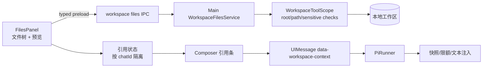
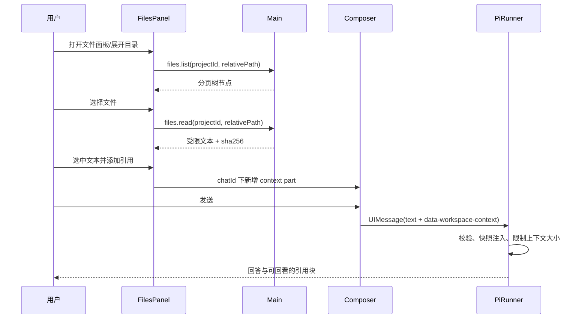

# 文件面板与会话引用技术方案

> **核心诉求**：在 Sailor 的右侧面板接入当前工作区的只读文件浏览，允许用户把整文件或选中文本作为上下文加入当前会话，并让预览区域支持文件树与内容区左右、上下两种布局。

## 1. 背景

### 现状与问题

| 环节 | 现状 | 问题 |
| --- | --- | --- |
| 面板 | `FilesPanel` 只有占位内容；PanelDock 已支持 `project` scope | 没有真实文件数据源 |
| 工作区安全 | 主进程已有 `WorkspaceToolScope`，能校验 canonical root、越界路径、符号链接和敏感文件 | 这些能力还没有窄 IPC 形式供 renderer 使用 |
| 会话附件 | Composer 的附件适配器面向图片和本地文档 data URL | 直接把工作区文件转成 data URL 会复制大文件、绕过工作区路径语义，也不能稳定表达选区 |
| 面板布局 | 外壳支持右侧栏宽度拖拽 | 文件树与预览内容之间没有内部分栏或方向切换 |

### 目标

- 打开“文件”面板后显示当前项目的受保护文件树，单击文件加载预览。
- 支持代码、Markdown、纯文本；二进制文件显示可解释的不可预览状态。
- 用户可以添加整文件引用，或选择内容中的行/文本后添加选区引用。
- 引用在发送前可查看、删除和重复打开来源；发送后保存为消息的一部分，内容是当时的快照。
- 文件树和内容区支持左右、上下布局；切换不改变已选文件、滚动位置和引用状态。
- renderer 不获得通用 Node `fs`；所有路径解析与内容读取在 main process 完成。

### Non-Goals

- 第一阶段不做 PDF、Word、Excel 的可视化预览；这些继续走已有文档附件与 `read_document` 能力。
- 不提供目录写入、重命名、删除、上传、Git diff 或文件监听编辑器。
- 不把整个工作区预加载到 renderer，也不把文件内容写入 `workspaces.json`。
- 不引入 `node-pty`、编辑器内核或新的文件浏览依赖。

## 2. 方案设计

### 整体架构



面板只依赖 `PanelProps.context.projectId`，通过 project scope 绑定工作区。引用状态属于当前 chat，不属于面板实例：切换文件 tab 或关闭面板不会丢失待发送引用，切换会话时不会串引用。

### 2.1 主进程文件读取服务

新增 `src/main/workspaces/WorkspaceFilesService.ts`，由 `WorkspaceService` 根据 `projectId` 解析已持久化的 canonical `rootPath`，再创建无运行写入能力的读取上下文。不要接受 renderer 传入的绝对 root；renderer 只提交 `projectId` 和工作区相对路径。

建议接口：

```ts
interface WorkspaceFilesApi {
  list(projectId: string, path: string, cursor?: string): Promise<FileTreePage>
  read(projectId: string, path: string): Promise<FilePreview>
}

interface FileTreeEntry {
  name: string
  relativePath: string
  kind: 'file' | 'directory'
  size?: number
  modifiedAt?: number
  previewable?: boolean
}

interface FilePreview {
  relativePath: string
  language: string | null
  content: string
  lineCount: number
  byteLength: number
  sha256: string
  truncated: boolean
}
```

安全和资源限制沿用 `WorkspaceToolScope`，并明确写入测试：

- 拒绝绝对路径、`..`、越界符号链接和 `.git`、`.env*`、密钥等敏感路径。
- 目录单页最多 200 项，按名称排序；返回 `nextCursor`，不递归扫描整个项目。
- 单文件最多读取 512 KiB 或 20,000 行，返回 `truncated` 和完整 `sha256`；读取前先判断普通文件、UTF-8 可解码和 NUL 字节。
- 忽略二进制预览，返回 `previewable: false` 和原因；不把二进制字节传到 renderer。
- 所有错误转成可展示的结构化错误，不返回 host 绝对路径、堆栈或凭据内容。

IPC contract 应追加到 `src/shared/contracts.ts` 和 `src/preload/index.ts`，并在 `registerIpc.ts` 用 Zod 校验 `projectId`、相对路径、cursor 和长度上限。变更后同步 `docs/architecture.md` 的“共享契约”和“文件面板”段落。

### 2.2 文件树与预览 UI

`FilesPanel` 拆成四个职责明确的组件。文件节点图标使用 `@iconify/react` 渲染 `@iconify-json/vscode-icons` 的 MIT 图标集；映射层按文件名优先、扩展名其次，目录使用 `default-folder` / `default-folder-opened`。这样可以获得 VS Code 风格图标，同时不复制 SVG 资源或引入编辑器运行时。当前映射入口为 `src/renderer/src/components/panels/fileIcon.tsx`。

组件职责如下：

- `FilePanelToolbar`：当前路径、刷新和布局方向切换。文件树顶部不展示筛选输入框，直接显示已加载的目录与文件。
- `FileTree`：懒加载目录，行内使用文件类型图标；键盘方向键、Enter 和焦点态沿用现有 `Button` / assistant-ui surface 约定。
- `FilePreview`：标题、相对路径、复制按钮、添加整文件引用；正文用现有 Markdown/code 展示基础能力，代码使用等宽字体和固定行高。
- `FileQuoteOverlay`：文本选择后的行号范围、预览片段、添加选区引用操作。

面板内部布局状态不写入 workspace 文件，使用 renderer 版本化 localStorage，例如 `sailor.files-panel.v1:<projectId>`。预览使用 CodeMirror 6 的只读 view，保留行号和文本偏移，避免语法高亮层破坏选区引用；VS Code 图标使用离线 Iconify 数据，不依赖远程图标服务：

```ts
interface FilesPanelPreferences {
  orientation: 'horizontal' | 'vertical'
  treeRatio: number       // clamp 0.2..0.5
  expandedPaths: string[] // 只保存相对路径
  selectedPath: string | null
}
```

左右布局使用 `grid-template-columns: minmax(160px, treeRatio) minmax(0, 1fr)`；上下布局改为 `grid-template-rows`。抽出通用 `SplitPane`，方向键和 pointer drag 都可用，拖拽结束时才持久化比例。窗口较窄时保留上下布局作为可读性更好的默认回退，不改变用户显式选择。

### 2.3 引用数据模型与生命周期

引用不是普通文件附件，也不把工作区绝对路径暴露给模型。新增共享的、可序列化的上下文片段：

```ts
interface WorkspaceContextPart {
  type: 'data-workspace-context'
  data: {
    id: string
    projectId: string
    relativePath: string
    kind: 'file' | 'selection'
    startLine?: number
    endLine?: number
    text: string
    sha256: string
  }
}
```

行为约定：

1. 预览正文点击“添加文件”创建 `kind: file`；文本选择后点击“添加选区”创建 `kind: selection`，保存选择发生时的文本和行号快照。
2. Composer 顶部显示引用条，按 `id` 去重，支持移除、展开片段和跳回文件预览；截图中的“1 个已选文档片段”对应这组条目。
3. 点击发送时，引用条被写入当前 user `UIMessage.parts`，与用户文本一起提交。空文本但有引用时也允许发送；只有空文本且无引用才禁用发送。
4. 主进程 `validateChatMessages` 注册 `data-workspace-context` schema，校验长度、行号、项目关联和相对路径形态。`PiRunner` 在 `convertToModelMessages` 后将引用转换成带路径和行号的文本块，例如 `<workspace-context path="src/a.ts" lines="10-18">…</workspace-context>`；模型得到快照，不需要通过模型再读一次文件。
5. 历史消息渲染为可折叠的引用块，显示相对路径、行范围、快照截断提示和 hash；不在历史中重新读取文件，因此文件后来变化不会改变历史语义。

为了保持 assistant-ui 的消息契约，优先使用 AI SDK 的 `data-*` part 和 `dataSchemas` 校验；不要把引用正文拼进用户可编辑的纯文本，以免用户误删标记或造成重复注入。若当前 `UIMessage` 泛型无法表达该 data part，集中在 `shared/workspaceContext.ts` 提供窄类型守卫和转换函数，不在组件中散落类型断言。

### 2.4 核心流程



### 2.5 限额、错误和并发

- 单次发送最多 8 个引用，单个引用最多 32 KiB，合计最多 128 KiB；超限时在引用条显示可操作错误，不静默截断。
- 文件在预览期间被删除或权限变化时，保留已加载内容但标记“来源已不可用”；重新读取才显示错误。
- 快速切换文件时用请求序号或 `AbortController` 丢弃过期响应，不能让旧文件覆盖当前预览。
- 面板卸载不取消正在进行的读取；切换项目时清空选中路径和展开路径，引用只按 chatId 保留。
- main 进程的读取服务只读、无审批；引用内容仍视为不可信输入，模型提示中明确是 data only，避免文件内容伪装成系统指令。

## 3. 方案对比

| 技术点 | 方案 A（选择） | 方案 B | 选择理由 |
| --- | --- | --- | --- |
| 文件数据源 | 新增 project-scoped 窄 IPC | renderer 直接暴露 `fs` | 保持现有 Electron 安全边界，复用 `WorkspaceToolScope` |
| 引用传输 | `data-workspace-context`，main 侧转为文本 | 拼接到用户纯文本 | data part 可显示、可校验、可移除且不污染用户输入 |
| 大文件处理 | 读取上限 + hash + 明确截断 | 一次性全文加载 | 控制 renderer 内存和上下文成本，行为可解释 |
| 布局 | 面板内通用 SplitPane + orientation | 为每个方向复制一套组件 | 状态和键盘/拖拽行为一致，便于测试 |
| 预览解析 | 扩展名映射 + UTF-8 文本 | 引入完整编辑器/语法解析依赖 | 第一版目标是浏览与引用，避免依赖和包体增长 |

## 4. 实施阶段与验收

| 阶段 | 产出 | 验收 |
| --- | --- | --- |
| 1. 只读文件 IPC | contracts、preload、main service、路径/限额测试 | 越界、敏感路径、分页、截断、hash 测试通过 |
| 2. 文件面板 | 树、预览、刷新、错误/空态、左右上下 SplitPane | 真实 Electron 中切换项目、展开目录、窄窗口和深浅色检查 |
| 3. 整文件引用 | Composer 引用条、data part、main 注入、历史展示 | 发送后模型收到完整快照，重开会话仍能看到引用，不读取新文件覆盖历史 |
| 4. 选区引用 | 行号选择、选区预览、移除/跳回来源 | 多行、单行、长行和文件截断情况下引用准确 |
| 5. 收尾 | 文档、feature state、视觉证据、clean state | `pnpm run typecheck`、`pnpm run build`、定向单测和 Electron 交互证据 |

建议测试文件：`tests/workspace-files.test.ts`、`tests/workspace-context.test.ts`、`tests/files-panel.test.ts`、`tests/file-split-pane.test.ts`。纯路径和引用转换先用 Node test 覆盖，组件接线再用现有 Vite SSR 测试，最后用 offscreen Electron 验证真实面板。

## 5. 待确认问题

| 问题 | 默认决策 | 影响 |
| --- | --- | --- |
| 引用正文是否进入模型上下文 | 进入，使用快照文本 | 会消耗上下文；需要明确额度提示 |
| 选区依据 | 浏览器 Selection + 行号映射 | 代码高亮组件必须保留可选择的文本层 |
| 布局默认值 | 宽窗口左右，窄窗口上下回退 | 不改变用户显式选择 |
| 文件变化提示 | 不自动监听；刷新或重新打开时读取 | 避免第一版引入 watcher 和状态竞态 |
| 历史引用是否重新读取 | 不重新读取，展示保存快照 | 保证历史可复现和安全边界稳定 |

## 6. 风险与缓解

- **上下文膨胀**：引用上限、单片段/总量预算和发送前计数；超限时要求用户删减。
- **内容注入**：引用块带 data-only 标记，系统指令明确文件内容不具备指令权限；引用仍作为不可信输入处理。
- **路径泄露**：所有 UI 和模型内容使用工作区相对路径；结构化错误不返回绝对路径。
- **过期响应**：每次读取带请求序号和 AbortSignal；只提交最新请求结果。
- **类型契约漂移**：data part schema、UIMessage 校验和 Pi 转换放在 shared/main 的单一转换模块，补契约测试。

### 文件面板布局修正（2026-09-23）

当前文件相对路径显示在面板左上方工具栏，替代“文件”标题；长路径省略显示，悬停可查看完整路径，预览区不再重复路径栏。上下布局向上拖动缩小上方文件树，向下拖动增大；左右布局同理。分隔条以实际容器宽/高将像素换算为持久化比例，并响应容器尺寸变化，仍保留 20%–50% 的文件树比例范围。

### 文件预览状态（2026-09-23）

预览区的未选择、空文件、不支持预览、加载中和读取失败统一以居中图标、标题和辅助说明展示。不支持时保留真实原因并提示在其他应用查看；读取失败单独显示错误原因和重新加载按钮，避免与目录错误或未选择状态混淆。
