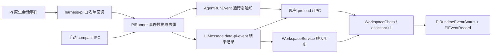
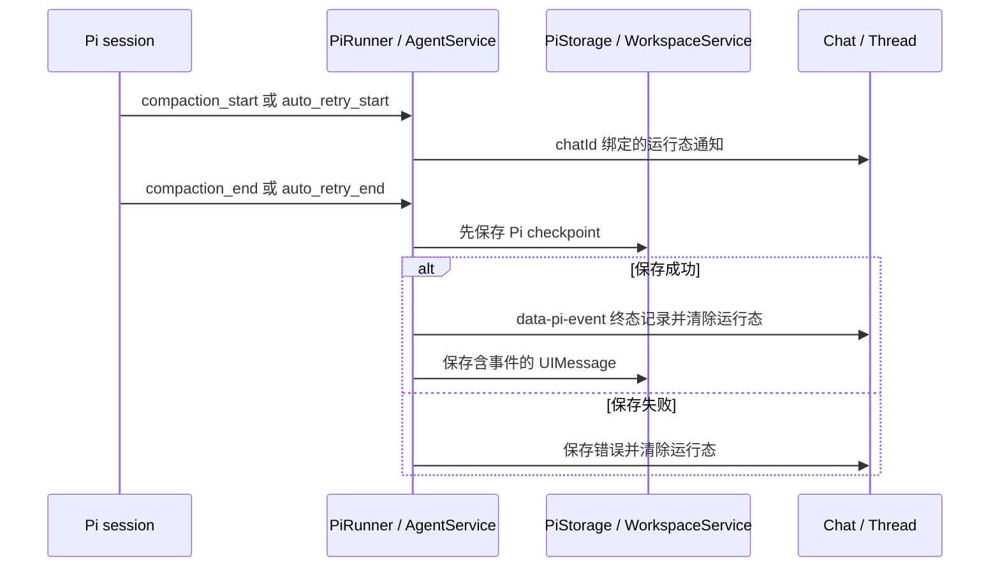

# Pi 运行事件在 Sailor 中的展示方案

> **核心诉求**：让用户在长会话中看清 Pi 正在压缩上下文或自动重试，以及这些操作最终是否成功；完成记录应能随聊天历史恢复。

- 状态：已实施，2026-09-28；以下方案描述当前事件投影和展示契约。
- 基线：`@earendil-works/pi-coding-agent@0.84.4`、`@ai-sdk/harness-pi@1.0.119`、`ai@7.0.107`、`@assistant-ui/react@0.15.21`。实施前复核安装版本与本地类型。
- 本文描述目标行为；[architecture.md](architecture.md) 仍描述当前已实现架构。

## 1. 背景

| 环节            | 当前行为                                                              | 用户可见问题                                                     |
| --------------- | --------------------------------------------------------------------- | ---------------------------------------------------------------- |
| 自动压缩        | Pi 的 `compaction_end` 经 Harness 变为动态 `compaction` 工具调用      | 只看到通用工具行，无法立即识别“上下文已自动压缩”；没有压缩中提示 |
| 手动 `/compact` | `AgentService.compact` 单独调用 `session.compact()` 并保存 checkpoint | 不经过聊天流，成功后没有同类历史记录                             |
| 自动重试        | Pi 发出 `auto_retry_start/end`，当前 Harness 不转发                   | 等待期间及恢复/失败结果缺少明确反馈                              |
| 历史            | 聊天 `UIMessage` 与 Pi checkpoint 分别持久化                          | UI 必须从聊天历史恢复事件，不能重新执行 Pi 操作来重建展示        |

### 目标和验收

1. 自动压缩、手动压缩均显示进行中状态；成功、失败、取消显示不同的结束状态。成功记录进入聊天历史，重新打开后位置与内容一致。
2. 真实的 Pi 自动重试显示当前尝试次数，结束时显示恢复或失败；没有重试时不出现记录。
3. 同一事件在聊天中最多出现一条结束记录；后台运行、切换会话、停止、重启后不串状态，不留下永久的“正在处理”。
4. 原有文本、推理、工具、审批及模型调用行为保持一致。压缩成功后不继续显示压缩前的上下文用量；Pi 未提供压缩后 token 数，卡片提示待下一次模型调用返回真实用量。

本期只承接 `compaction_start/end` 与 `auto_retry_start/end`。Pi 的会话树、队列、模型切换、summary 内部重试和全部 telemetry 暂不进入此 UI；不改变压缩阈值、重试策略或 `/compact` 参数语义，也不新增运行时依赖。

## 2. 方案设计

### 2.1 关键取舍

| 方案                                             | 优点                                                           | 限制                                                 | 结论             |
| ------------------------------------------------ | -------------------------------------------------------------- | ---------------------------------------------------- | ---------------- |
| 给现有 `compaction` 工具行换文案                 | 改动小                                                         | 无压缩中、失败、手动压缩和自动重试；事件仍混在工具组 | 仅用于旧历史兼容 |
| 将事件投影为有类型的 Sailor 状态与消息 data part | 运行态和历史各有明确归属；可复用 assistant-ui 的消息 part 管线 | 需处理 Pi 事件接入、手动压缩及旧工具记录去重         | 采用             |
| 增加独立事件表并重写消息列表排序                 | 历史与消息分开                                                 | 需要跨两份持久化数据维护顺序和恢复逻辑               | 本期不采用       |

Pi 原生会话的 `subscribe()` 能看到上述四类事件，但 Harness 当前只将成功的 `compaction_end` 译为 `compaction`。`extensionFactories` 可监听压缩相关生命周期钩子，不能监听 `auto_retry_start/end`。因此在现有 `harness-pi` pnpm patch 中增加**仅供 main 使用的白名单事件回调**，在 Pi 原生订阅处转发四种事件；回调不暴露给 renderer，也不改变模型工具集合。升级 Harness 时优先检查上游是否已有等价事件出口，并重新验证 patch。

### 2.2 职责和数据流



- **main**：按 `chatId`、`runId`、事件 ID 投影和界定生命周期；只传有限的展示字段。Pi 原始消息、provider 错误对象、凭据及完整摘要不跨 preload。
- **运行态**：通过现有 `AgentRunEvent` 增加类型化 `pi-event` 分支，由按聊天隔离的状态组件消费。`IpcChatTransport` 明确忽略该分支，不能将其误判为流结束。手动压缩使用独立 operation ID，但复用同一通知格式。
- **历史态**：成功/失败/取消的最终结果使用 `data-pi-event` 消息 part；运行中的状态不写入历史。自动运行由现有 `UIMessageChunk` 流进入 `WorkspaceService.updateRun`；手动 `/compact` 由 main 在保存 Pi checkpoint 后将结束 part 附到最近的 assistant 消息，并把更新后的消息返回给已打开的 `Chat` 实例同步。若没有 assistant 消息，则追加仅含该 data part 的 assistant UIMessage；模型输入投影显式排除这种事件专用消息。
- **renderer**：一个 `PiEventRecord` 负责有类型的历史行，一个 `PiRuntimeEventStatus` 负责当前运行提示，并位于 Thread 消息列表末尾。复用 `MessagePrimitive.GroupedParts` 的 data 分支、`makeAssistantDataUI` 和现有 Thread/provider；不建立第二套聊天 runtime。成功压缩使旧用量失效，下一次模型调用后再读取真实用量。图标、间距和颜色遵循项目 assistant-ui tokens。



### 2.3 事件契约

在 shared 中定义可校验的封闭联合类型，首期仅包含：

```ts
type PiDisplayEvent =
  | {
      id: string
      kind: 'compaction'
      phase: 'started' | 'succeeded' | 'failed' | 'cancelled'
      trigger: 'manual' | 'threshold' | 'overflow'
      at: number
      tokensBefore?: number
    }
  | {
      id: string
      kind: 'retry'
      phase: 'started' | 'succeeded' | 'failed' | 'cancelled'
      attempt: number
      maxAttempts: number
      at: number
    }
```

`id` 在一次压缩或一次连续重试周期内稳定；后续尝试更新同一重试状态，最终只落一条记录。数量字段限制为安全整数并设置合理上限；`tokensBefore` 仅在 Pi 实际提供时出现。错误文本、压缩摘要和原始事件 payload 本期不持久化，失败记录使用可信的固定文案，具体运行错误继续由现有聊天错误 UI 呈现。新增事件类型须扩展联合类型、投影、文案和测试；未知类型不伪装成成功。

### 2.4 生命周期与顺序

1. 收到 `compaction_start` 或首个 `auto_retry_start` 后，main 创建/更新本 chat 的运行态通知。UI 显示“正在整理上下文”或“连接中断，正在重试（n/m）”；不展示进度百分比。
2. `compaction_end` 根据 `aborted`、`errorMessage` 和 `result` 判定成功、取消或失败；`auto_retry_end` 根据 `success` 判定恢复或失败。结束通知清除运行态，并生成同 ID 的最终 data part。压缩的 `threshold`/`overflow` 显示“上下文已自动压缩”，`manual` 显示“上下文已压缩”。自动运行需将终态 part 留在 main，待 Pi checkpoint 保存成功后再送入聊天流；若 checkpoint 保存失败，沿用现有错误路径，不留下成功记录。手动操作也遵守同一顺序。Pi checkpoint 与聊天存储之间没有原子事务；聊天保存失败时保留现有保存错误和重试入口，不能静默宣称历史已持久化。
3. 自动压缩现有的动态 `compaction` 工具片段在新消息构造时只用于内部兼容，不再重复写入新 UI 历史。旧历史中的片段由专用兼容 renderer 显示一条同类记录，不重放事件或更改旧消息。
4. 停止、异常或窗口重启后丢弃内存运行态；已有终态记录照常恢复。无法匹配的迟到事件、重复终态、其它 chat/run 的事件均忽略。手动压缩在 main 的既有互斥检查下运行，持久化和前端同步失败需给出可重试错误，不能让 UI 显示成功而 checkpoint 未保存。
5. 事件 part 是展示数据。送往模型的历史转换需验证它不会成为提示文本，也不会触发工具执行；历史恢复只读取 `UIMessage`，不调用 Pi 压缩或重试。

### 2.5 视觉与可访问性

- 在会话消息列表中显示简洁的图标加短句记录，不使用工具卡片或悬浮大卡片；压缩与重试行使用相同组件和状态布局。
- 运行态使用已有运行强调色，完成态用中性文字，失败态用语义错误色；只对真实进行中的状态使用轻微动效，并支持 `prefers-reduced-motion`。
- 使用 `role="status"`/`aria-live="polite"` 宣告开始和最终结果，避免每次重试倒计时刷屏；失败信息可通过现有错误 UI 查看。
- Electron 验收覆盖浅色、深色、窄窗口、后台完成、会话切换、重启恢复、键盘焦点和消息滚动；不得与工具组或上下文圆环重复、遮挡。

## 3. 实施与验证

| 阶段 | 交付物                                | 主要验证                                                                       |
| ---- | ------------------------------------- | ------------------------------------------------------------------------------ |
| 1    | 白名单原生事件出口、shared 契约与投影 | 四类事件的映射、去重、迟到与跨 chat 隔离测试                                   |
| 2    | 自动流与手动 `/compact` 的终态持久化  | 运行/失败/取消、历史恢复、模型输入不含事件、checkpoint 保存失败测试            |
| 3    | assistant-ui 事件组件与旧历史兼容     | 专用 Electron 冒烟、亮暗/窄窗口截图和视觉检查                                  |
| 4    | 文档与回归                            | `pnpm run typecheck`、`pnpm run build`、相关 Pi/聊天测试及 feature verify gate |

实施时同步更新 `docs/architecture.md` 和 README 的能力说明。当前设计没有需要用户决定的产品选项；如 Harness 版本变化导致白名单回调无法维持，先重新评估等价事件出口，再修改方案与 feature checklist。
